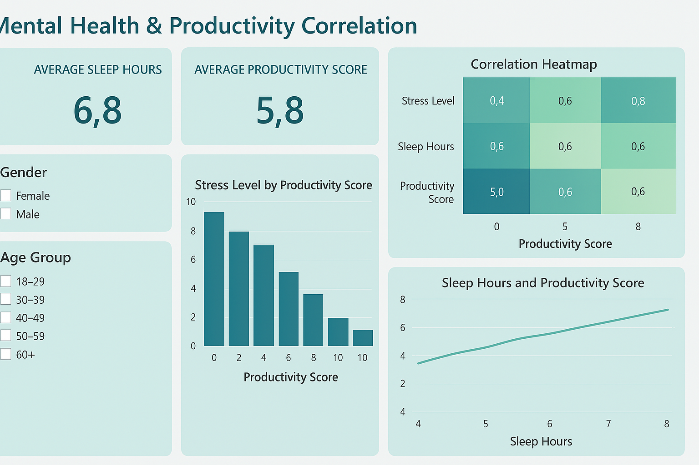

# Mental Health & Productivity Correlation Analysis

## Overview
This project explores the impact of mental health factors on employee productivity using Excel, SQL, Power BI, and IBM Cognos Analytics. It also includes predictive modeling using advanced SQL.

## Tools Used
- Excel
- SQL (MySQL/PostgreSQL)
- Power BI
- IBM Cognos Analytics

## Features
- Cleaned & merged multiple mental health datasets
- SQL queries for insights and risk profiling
- Interactive dashboards in Power BI & Cognos
- Predictive productivity modeling in SQL

## How to Use
1. Run SQL scripts in `/sql` folder.
2. Open Power BI or Cognos dashboards.
3. Refer to README and screenshots for insights.

## Screenshots

<!-- Cognos screenshot will be replaced once charts are fixed -->

## License
MIT License
